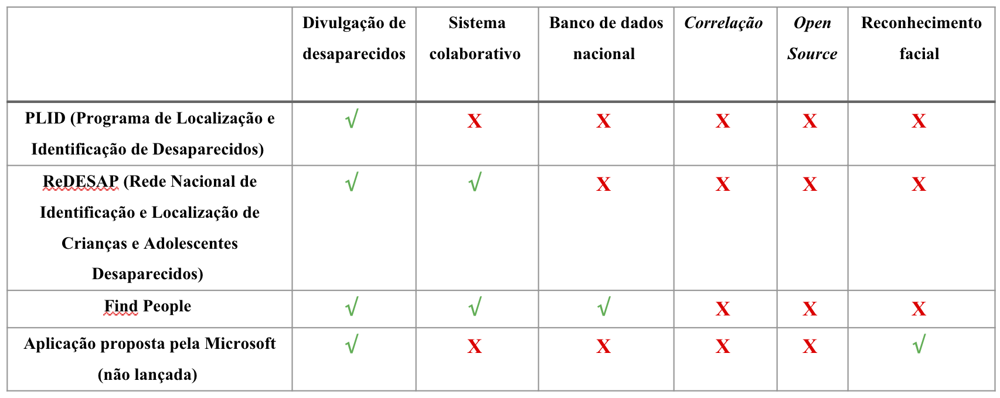

# Benchmarking (tabela comparativa de projetos correlatos)

Segue o benchmarking utilizado no projeto, ou seja, a tabela comparativa elaborada com o objetivo de analisar os sistemas correlatos ao proposto, com suas similaridades e diferenciais.  

