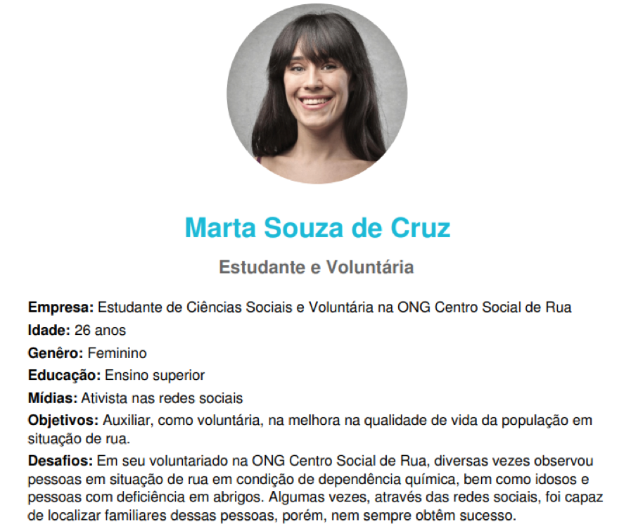
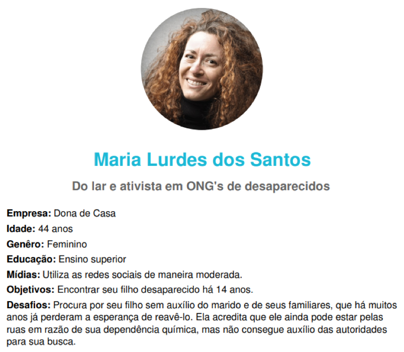
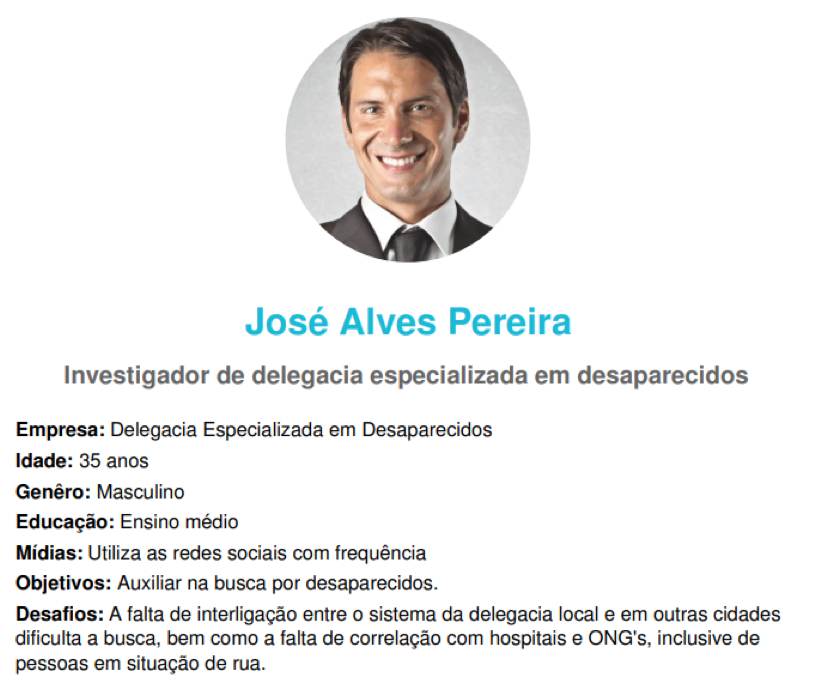

# Personas

A seguir, apresenta-se as personas concebidas durante a elaboração do projeto. Essas representações fictícias foram elaboradas a fim de identificar características comportamentais do público alvo da aplicação.  

A primeira persona, denominada Marta Souza de Cruz, representa uma estudante de Ciências Sociais e uma voluntária regular na ONG Centro Social de Rua em Porto Alegre, bem como esporadicamente em alguns abrigos e albergues da região.

A segunda persona, denominada Maria Lurdes dos Santos, representa uma mãe que procura por seu filho desaparecido.  

A terceira persona, denominada José Alves Pereira, representa um investigador de uma delegacia especializada em desaparecidos em Florianópolis.  

